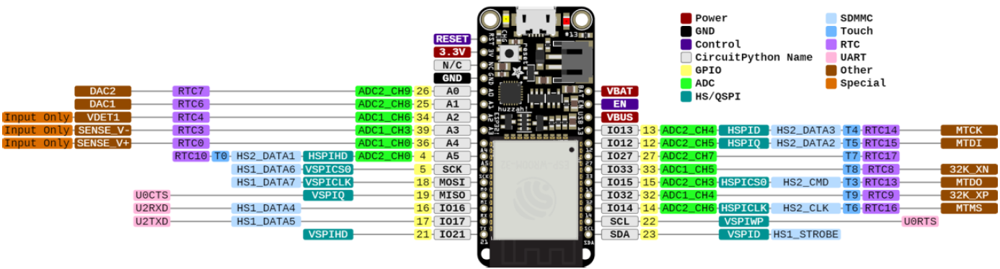
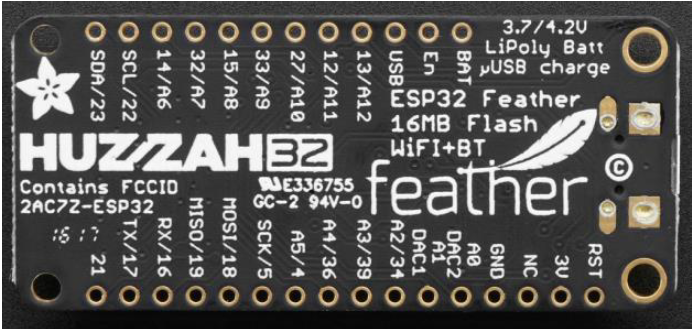
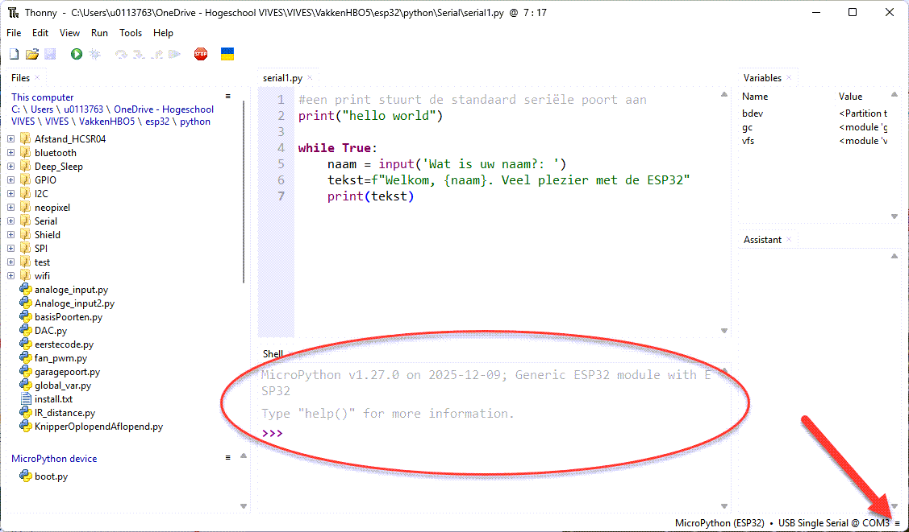
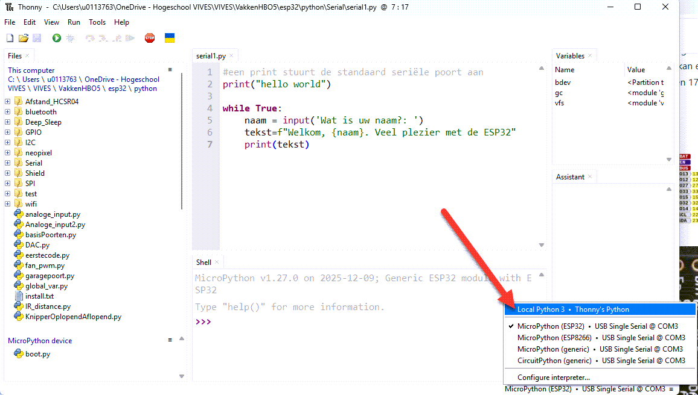
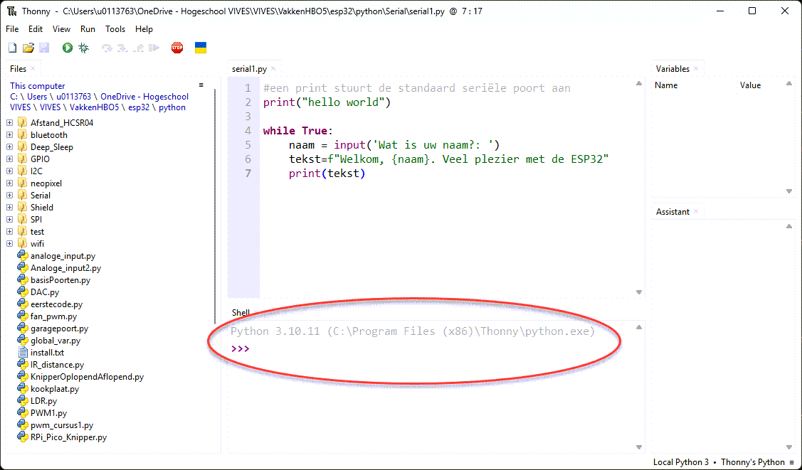

---
mathjax:
  presets: '\def\lr#1#2#3{\left#1#2\right#3}'
---

# ESP32 en seriële communicatie

De ESP32 heeft drie universal asynchronous receivers en transmitters (UART) poorten die UART0, UART1 en UART2 heten die werken op een 3,3V TTL niveau. Deze drie seriële interfaces zijn hardwarematig uitgevoerd. Elk van hen hebben 4 aansluitpinnen, namelijk: Rx, Tx, RTS, CTS

Natuurlijk moet de GND van de twee communicerende apparaten ook verbonden worden.
De MicroPython gebruikt enkel de RX en TX pinnen.
Bij default kunnen enkel UART0 en UART2 gebruikt worden. De aansluitingen van UART1 worden gedeeld met de aansluitingen van de SPI-interface die intern verbonden zijn met het SPI flash memory. Enkel op sommige ESP32 boards is UART1 naar buiten gebracht op een pinout haeders.
De ESP32 feather van Adafruit kan enkel UART0 en UART2 gebruikt worden. UART0 is de micro-USB aansluiting en UART2 is pin 16 en 17 die zijn weergegeven in het roze van volgende figuur.





## print - input (UART0 = virtuele USB UART)

:::warning
Standaard gebruikt de Thonny-IDE een virtuele seriële communicatie over de USB-kabel om code/data over te brengen. Ook de statements `print` en `input`gebruiken diezelfde seriële poort. Dit gebeurt via UART0. Deze is verbonden met de pinnen 1 en 3 van de ESP32. Let wel deze pinnen zijn niet beschikbaar op de headers. Er kunnen zich problemen voordoen met de communicatie tussen Thonny en de ESP32 als er code wordt geschreven die impact heeft op die pinnen. Let dus op. Standaard Baudrate is ***115200***!! Andere snelheden liggen in standaarden vast, daar zijn: 300, 600, 1200, 2400, 4800, 9600, 13400, 19200, 28800, 31250, 38400, 57600, 115200
:::

> :bulb: **Opmerking:** Om via pinnen op de headers een seriële communicatie op te zetten (bijvoorbeeld om twee ESP32's met bedrading met elkaar te laten communiceren) is er nood om een bibliotheek bij te installeren. Zie verder


::: warning
Als er een python script in Thonny wordt uitgevoerd (script moet niet op de ESP32 als bestand aanwezig zijn maar moet wel runnen), kan er data via de USB UART0 uitgewisseld tussen de computer (ander programma dan Thonny, zoals RealTerm, Node Red, ...) en de ESP32. De COM-poort van de laptop kan door het operating systeem worden vrijgegeven (wordt dan niet meer gebruikt door Thonny), door in Thonny de verbinding met die COM-poort te verbreken nadat er op de RUN knop (in Thonny) is gedrukt. Het script blijft draaien op de ESP32. Natuurlijk bij een reset start het script niet meer op. De verbinding kan volgens de volgende figuur worden verbroken:
:::



Klik op de streepjes rechtsonderaan in het scherm van Thonny en selecteer de lokale Python optie van Thonny. Dus niet meer de MicroPython van de ESP32.





Nu is de COM-poort vrij voor andere laptop-programma's en er is runtime op de ESP32 van de laatst geactiveerde python code.

> :warning: **Warning:** Indien vorige toch niet lukt, dan zit er niets anders op dan de MicroPython code vast in de ESP32 te programmeren.  

> :memo: **Note:** Dit doe je door uw code dan lokaal op te slaan in de ESP32 onder de bestandsnaam `main.py` Hiermee zal uw ESP32 steeds opstarten met deze code.

> :bulb: **Tip:** Is het nodig om terug in de Python prompt te werken dan is een herinstallatie van de MicroPython noodzakelijk, zie hiervoor de handleiding : [Link](https://iot-lab-basic-python.netlify.app/) 

<div style="background-color:darkgreen; text-align:left; vertical-align:left; padding:15px;">
<p style="color:lightgreen; margin:10px">
Opdracht: Voltmeter
<ul style="color: white;">
<li>Maak een voltmeter waarvan de waarde van de gemeten spanning naar de seriële monitor wordt gestuurd.
</li>
<li>De voltmeter meet spanningen tussen 0V en 3,3V (=voedingsspanning). Om de voltmeter te testen maak je gebruik van de trimmer (potentiometer) op de ESP32 shield. Je moet niet enkel de waarde versturen maar ook wat de waarde is. Als de loper bijvoorbeeld volledig bovenaan staat zal je de waarde 0V moeten doorsturen. Als de loper volledig onderaan staat zal je de waarde 3,3V moeten doorsturen.</li>
<li>Als je weet dat de ADC (=Analoog naar digitaal converter) een resolutie heeft van 12 bit. Dan moeten jullie de digitale waarde die jullie binnen krijgen gemakkelijk kunnen omzetten.
</li>
</ul>
</p>
</div>

***

<div style="background-color:darkgreen; text-align:left; vertical-align:left; padding:15px;">
<p style="color:lightgreen; margin:10px">
Opdracht: communicatie tussen ESP en NodeRed-dashboard.
<ul style="color: white;">
<li>Maak een dashboard in Node-Red op de laptop.</li>
<li>Display de waarde van de potentiometer (Gauge) in volt, door de waarde van de potentiometer in een loop door te sturen via een seriële verbinding met de laptop.</li>

</ul>
</p>
</div>

***

<div style="background-color:darkgreen; text-align:left; vertical-align:left; padding:15px;">
<p style="color:lightgreen; margin:10px">
Opdracht: communicatie tussen ESP en RealTerm.
<ul style="color: white;">
<li>Zorg dat je vanuit Reaterm een getal (0-255) kunt sturen naar de ESP32</li>
<li>De ESP32 zet dit getal binair om in 8 bits en stuurt daarmee de 8Leds op de shield aan.</li>

</ul>
</p>
</div>


## Configuratie van de UART

Om de seriële poorten (los van `print()` en `input()`) te gebruiken wordt de UART bibliotheek gebruikt. Ten eerste zal de bibliotheek moeten toegevoegd worden aan het programma.

```python
from machine import UART
```

Na het toevoegen van de bibliotheek kan er een object gedeclareerd moeten worden van de klasse UART waarbij de gebruikte poort meegegeven kan worden. Bij de aanroep moet worden meegegeven welke UART je object zal aansturen. Bij de ESP32 is er de mogelijkheid UART0, 1 en 2. Bij de ESP32 feather van Adafruit kan enkel UART0 en 2 gebruikt worden. In het onderstaande voorbeeld wordt een object gemaakt met de naam `uart1`.

```python
uart1 = UART(1, baudrate=9600, Tx=33, RX=32)
uart1.write('hello')
uart1.read(5) #read up to 5 bytes
```

|          | UART0 | UART1 | UART2 |
| --- | --- | --- | --- |
| tx  | 1 | 10 | 17 |
| rx  | 3 | 9 | 16 |


Vervolgens zal de poort in de setup-routine ingesteld moeten worden door de begin methode op te roepen.

Een verdere studie omtrent seriële communicatie (alle bruikbare methodes) kan gevonden worden bij de informatie over microPython en dit specifiek hier op: [MicroPython UART](https://docs.micropython.org/en/latest/library/machine.UART.html#machine.UART)


